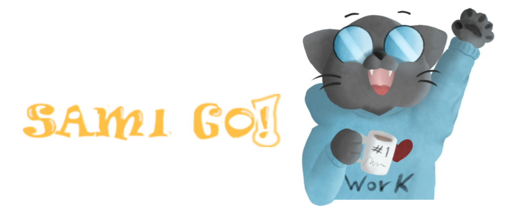
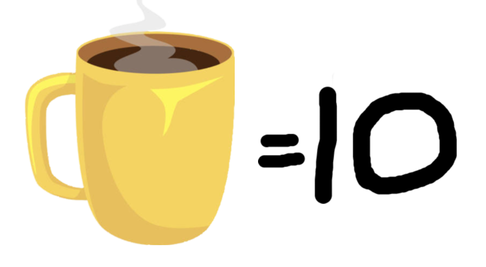
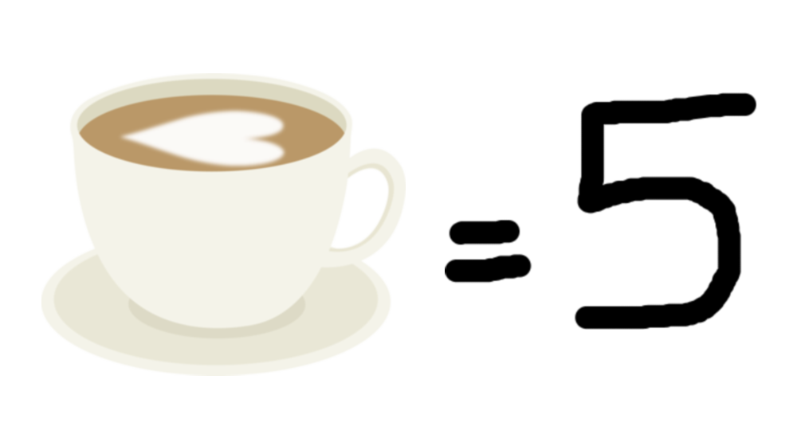
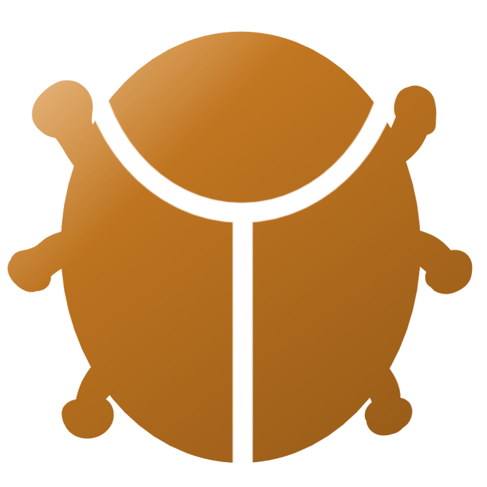
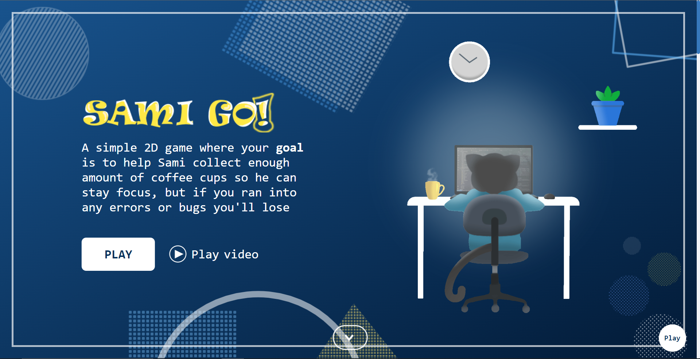
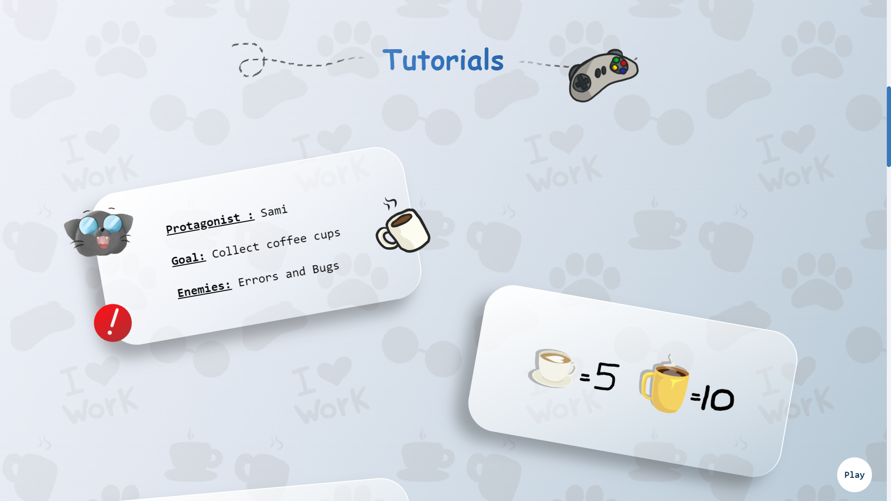
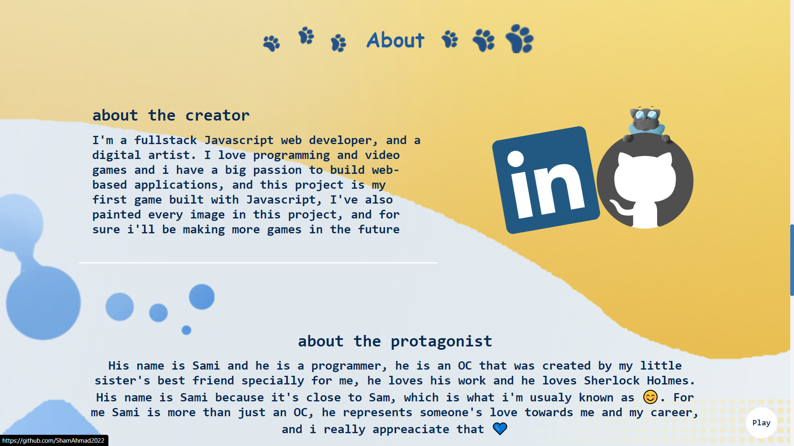
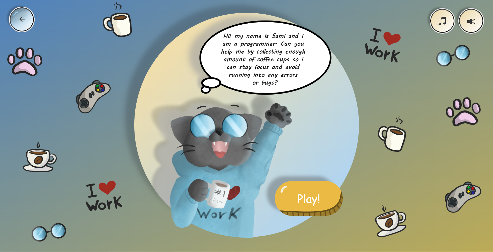
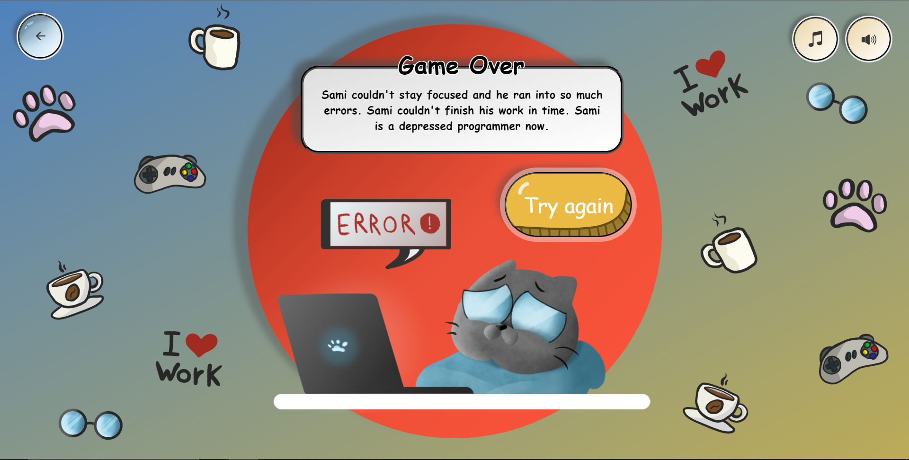
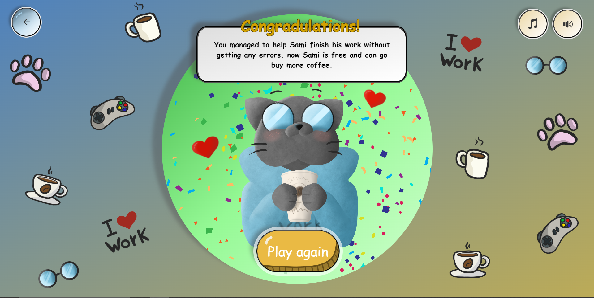

<h1>SAMI GO! <small>1.2.0</small></h1>

<a href="https://shamahmad2022.github.io/SamiGo/index.html">Press to play </a> | <a href="https://drive.google.com/file/d/1YpN-74IL_-I6WrQfe0_EL9M4ysCHRgk8/view"> Watch Video</a>

<h2>Description</h2>

A simple 2D game where your goal is to help Sami collect enough amount of coffee cups so he can stay focus, but if you ran into any errors or bugs you'll lose.

<h2>How to play</h2>

- After opening the link, press on 'Play' button to play the game.

 

- You must collect enough amount of coffee cups, there is 2 main types of coffee cups to collect:

 

 
 
 

- Be careful to not run into any errors or bugs:

 

 
 
 

Enjoy ^-^

<h2>Screenshots:</h2>

<h2>creator's notes:</h2>

- I built this game using plain HTML, CSS and JS.

- As a digital artist, i was responsible for drawing most of the assets and backgrounds in the website. of course I thought about using assets from the internet, but nothing matched my style or what was in my mind, so it's a good thing to be both an artist and a programmer :) 

- I still have so many thoughts to add to the game, so I'll keep working on it and add new features, such as selecting different characters and add some challenges.

<h2>Copyright and License</h2>

Copyright 2023 Sham Al-Jalam. <a href="https://choosealicense.com/licenses/mit/"> MIT License </a>
